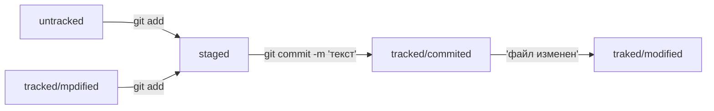

# Самое начало!

## Основы

Cуществует три главных способа навигации в Git:

pwd - показывает в какой ты папке

ls - показывает папки и файлы в текущей папке

 ls -a - покажет все и скрытыые папки и файлы

cd - переход в указаную папку

 cd .. - переход на уровень выше

 cd ~ - переход на домашнюю директорию

## Работа с файлами и папками
Создание

touch todo.txt - создает todo.txt в текущей папке

mkdir first-project - создает директорию(папку) с именем first-project в текущей директории

## Копирование и перемещение 
cp что куда - копирует и вставляет в другое место

mv что куда - перемещает в другое место

## Чтение
cat todo.txt -вывод содержимого todo.txt

## Удаление
rm todo.txt - удаляет файл в текущей директории

rmdir first-project - удаляет директорию

rm -r first-project - удаляет директорию с полным удалением содержимого

## Полезные возможности
Команды можно писать в строку через &&

Есть буфер последних команд вызывающийся через стрелки ↑ и ↓

Чтобы не вводить названия полностью можно воспользоваться Tab, она допишет название сама

## Хэш

Хеширование — это способ преобразовать набор данных и получить их «отпечаток»


Информация о коммите — это набор данных: когда был сделан коммит, содержимое файлов в репозитории на момент коммита и ссылка на предыдущий, или родительский коммит

## Логи

```
git log
```

Выведет информацию о коммитах: его хэш, кто оставил, когда и название коммита

Можно получить более сокращенный лог через команду 
```
git log --oneline
```
В терминале появятся только первые несколько символов хеша каждого коммита и их комментарии.

## HEAD

При вызове команды git log вы также могли заметить надпись (HEAD -> master) после хеша одного из коммитов.

### Файл HEAD
Файл HEAD — один из служебных файлов папки .git. Он указывает на коммит, который сделан последним (то есть на самый новый).

```
$ pwd # посмотрели, где мы
/Users/user/dev/first-project

$ cd .git/
$ ls # посмотрели, какие есть файлы
COMMIT_EDITMSG  ORIG_HEAD  description  index  logs/     refs/
HEAD            config     hooks/       info/  objects/

$ cat HEAD # команда cat показывает содержимое файла
ref: refs/heads/master # в файле вот такая ссылка 
```

Внутри HEAD — ссылка на служебный файл: refs/heads/master (или refs/heads/main в зависимости от названия ветки). Если заглянуть в этот файл, можно увидеть хеш последнего коммита.

```
$ cat refs/heads/master # взяли ссылку из файла HEAD
# внутри хеш
e007f5035f113f9abca78fe2149c593959da5eb7

$ git log 
# сверяем с хешем последнего коммита
commit e007f5035f113f9abca78fe2149c593959da5eb7
Author: John Doe <johndoe@example.com>
Date:   Tue Mar 28 00:26:53 2023 +0300

    Добавить амбиций в список дел

... # другие коммиты
```

## Статусы в Git и их жизненный цикл

### untracked (англ. «неотслеживаемый»)

Новые файлы в Git-репозитории помечаются как untracked, то есть неотслеживаемые. Git «видит», что такой файл существует, но не следит за изменениями в нём. У untracked-файла нет предыдущих версий, зафиксированных в коммитах или через команду git add.

### staged (англ. «подготовленный»)
  После выполнения команды 
```
git add 
```
файл попадает в staging area, то есть в список файлов, которые войдут в коммит. В этот момент файл находится в состоянии staged.

### tracked (англ. «отслеживаемый»)

Состояние tracked — это противоположность untracked. Оно довольно широкое по смыслу: в него попадают файлы, которые уже были зафиксированы с помощью git commit, а также файлы, которые были добавлены в staging area командой git add. То есть все файлы, в которых Git так или иначе отслеживает изменения.

### modified (англ. «изменённый»)

Состояние modified означает, что Git сравнил содержимое файла с последней сохранённой версией и нашёл отличия. Например, файл был закоммичен и после этого изменён.


И так по кругу